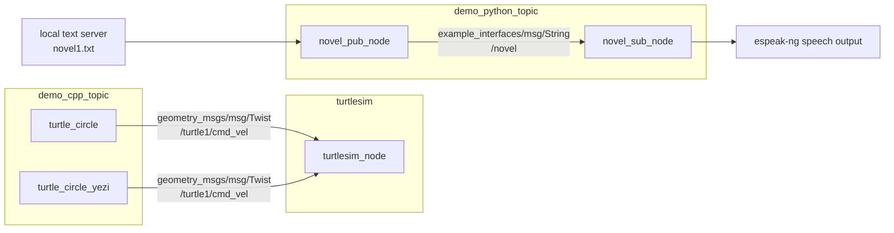

# ROS2 Topic Lab


一个用于理解 ROS 2 Topic 通信模型的双语言实验工程。项目同时包含 C++ 与 Python 两套节点：C++ 侧通过 `geometry_msgs/msg/Twist` 控制 `turtlesim` 小海龟运动，Python 侧通过 `example_interfaces/msg/String` 实现小说文本的发布、订阅与语音朗读。

这个仓库不是只放单个 demo，而是把 ROS 2 学习中最关键的几件事串了起来：工作空间组织、包声明、发布者、订阅者、定时器、消息队列、后台线程、文本服务和 `colcon` 构建流程。

## Architecture



## Project Layout

```text
topic_ws/
├── novel1.txt
├── novel2.txt
├── novel3.txt
└── src/
    ├── demo_cpp_topic/
    │   ├── CMakeLists.txt
    │   ├── package.xml
    │   └── src/
    │       ├── turtle_circle.cpp
    │       └── tutrtle_circle_yezi.cpp
    └── demo_python_topic/
        ├── package.xml
        ├── setup.py
        ├── demo_python_topic/
        │   ├── novel_pub_node.py
        │   ├── novel_sub_node.py
        │   └── _espeakng.py
        └── test/
            └── test_novel_sub_node.py
```

## Packages

| Package | Language | Nodes | Role |
| --- | --- | --- | --- |
| `demo_cpp_topic` | C++ / `rclcpp` | `turtle_circle`, `turtle_circle_yezi` | 发布 `Twist` 速度消息，让 turtlesim 小海龟持续画圆 |
| `demo_python_topic` | Python / `rclpy` | `novel_pub_node`, `novel_sub_node` | 发布小说文本，并在订阅端通过语音引擎朗读 |

## Environment

推荐环境：

- Ubuntu 22.04
- ROS 2 Humble
- Python 3
- `colcon`
- `turtlesim`
- `espeak-ng`

安装常用依赖：

```bash
sudo apt update
sudo apt install ros-humble-turtlesim python3-colcon-common-extensions espeak-ng
```

如果 Python 运行时报 `espeakng` 或 `requests` 缺失，可以在当前 Python 环境中安装：

```bash
pip install espeakng requests
```

## Build

```bash
cd topic_ws
source /opt/ros/humble/setup.bash
colcon build
source install/setup.bash
```

构建完成后，可以确认 ROS 2 已经识别到两个包：

```bash
ros2 pkg list | grep demo_
```

## Run: Turtlesim Circle

启动小海龟仿真器：

```bash
ros2 run turtlesim turtlesim_node
```

另开一个终端，进入工作空间并加载环境：

```bash
cd topic_ws
source /opt/ros/humble/setup.bash
source install/setup.bash
```

运行 C++ 发布节点：

```bash
ros2 run demo_cpp_topic turtle_circle
```

或者运行另一个练习版本：

```bash
ros2 run demo_cpp_topic turtle_circle_yezi
```

观察速度话题：

```bash
ros2 topic echo /turtle1/cmd_vel
```

核心逻辑是持续发布 `geometry_msgs/msg/Twist`：

```cpp
msg.linear.x = 1.0;
msg.angular.z = 0.5;
publisher_->publish(msg);
```

线速度让小海龟前进，角速度让小海龟转向，两者叠加后形成圆周运动。

## Run: Novel Publisher And Speech Subscriber

`novel_pub_node` 默认从本机 `http://127.0.0.1:8000/novel1.txt` 下载文本。先在 `topic_ws` 目录启动一个静态文本服务：

```bash
cd topic_ws
python3 -m http.server 8000
```

另开终端启动订阅与朗读节点：

```bash
cd topic_ws
source /opt/ros/humble/setup.bash
source install/setup.bash
ros2 run demo_python_topic novel_sub_node
```

再开一个终端启动发布节点：

```bash
cd topic_ws
source /opt/ros/humble/setup.bash
source install/setup.bash
ros2 run demo_python_topic novel_pub_node
```

观察文本话题：

```bash
ros2 topic echo /novel
```

这个链路展示了一个完整的生产者-消费者模型：

- `novel_pub_node` 下载文本，把每一行放入 Python `Queue`
- 定时器每隔 5 秒取出一行，发布到 `/novel`
- `novel_sub_node` 订阅 `/novel`，把消息放入朗读队列
- 后台线程从队列取消息，交给 `espeak-ng` 朗读

## Development Commands

只构建 C++ 包：

```bash
colcon build --packages-select demo_cpp_topic
```

只构建 Python 包：

```bash
colcon build --packages-select demo_python_topic
```

运行测试：

```bash
colcon test
colcon test-result --verbose
```

查看节点和话题：

```bash
ros2 node list
ros2 topic list
ros2 topic info /novel
ros2 topic info /turtle1/cmd_vel
```

## What This Project Demonstrates

- ROS 2 workspace 的基础组织方式
- `ament_cmake` 与 `ament_python` 两种包构建方式
- C++ 节点中的 `rclcpp::Node`、Publisher、Timer 和回调函数
- Python 节点中的 `rclpy.node.Node`、Publisher、Subscription 和 Timer
- ROS 2 消息类型：`geometry_msgs/msg/Twist` 与 `example_interfaces/msg/String`
- 使用队列解耦“消息接收”和“耗时处理”
- 使用后台线程避免语音朗读阻塞 ROS 2 回调
- 使用 `ros2 topic echo/info/list` 调试 Topic 通信

## Troubleshooting

如果运行节点时提示找不到包，通常是没有加载工作空间环境：

```bash
source install/setup.bash
```

如果小海龟窗口打开了但不运动，检查发布话题是否是：

```text
/turtle1/cmd_vel
```

如果小说发布节点下载失败，确认静态服务已经在 `topic_ws` 目录启动：

```bash
python3 -m http.server 8000
```

如果语音朗读不可用，确认系统命令和 Python 包都可用：

```bash
espeak-ng --version
python3 -c "import espeakng; print(espeakng.Speaker)"
```

## License

The packages in this workspace are released under the Apache-2.0 License.
